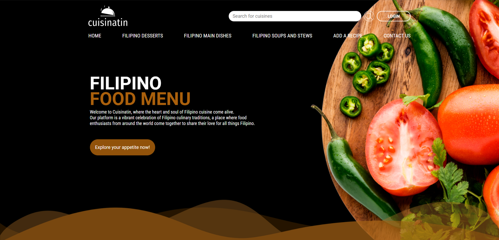

# Cuisinatin

**Cuisinatin** (from *Cuisine + Natin* = “Our Cuisine”) is a web-based system that allows users to browse Filipino cuisines, search for dishes, rate cuisines, comment, update their profile, and even post their own recipes with step-by-step instructions and ingredients.  

> ⚠️ This is our first-year college project. It's a basic PHP CRUD project and was mainly a learning exercise. Security and structure are very basic.

---

## UI Preview



---

## Features

- Browse and search Filipino cuisines  
- User login and profile management  
- Rate and comment on cuisines  
- Post new recipes with ingredients and steps  
- Simple CRUD operations for managing data  

---

## Tech Stack

- PHP (vanilla, procedural)  
- MySQL (via XAMPP)  
- HTML, CSS, JavaScript  
- No frameworks used; all raw PHP files  

> ⚠️ Database is not normalized and queries are insecure. This project is not production-ready.

---

## Installation / Running Locally

1. Install [XAMPP](https://www.apachefriends.org/index.html) and start Apache and MySQL.  
2. Clone the repository:
   ```bash
   git clone https://github.com/mark-ianz/cuisinatin.git
   ```
3. Copy the folder to your htdocs directory inside XAMPP.
4. Import the provided SQL file to MySQL via phpMyAdmin.
5. Open your browser and navigate to:
   ```bash
   http://localhost/index.php/
    ```
6. You’re good to go!
